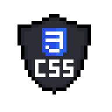
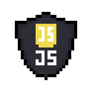

# Hello There! 

### Welcome to my Github profile

 
 I'm Gabriel, Bachelor in Petroleum Engineering, and Front-end student from <b>Brazil</b> .

### Where to find me:

<a href="https://www.linkedin.com/in/gabrielmarquesm/">
  <code></code>
</a>

<a href="mailto:gabrielmarques209@gmail.com">
  <code></code>
</a>

### About me:

 - I have a bachelor's degree in Petroleum Engineering, from Centro Universitário das Faculdades Metropolitanas Unidas (FMU | FIAM-FAAM).

 - I'm from São Paulo/SP.

 - I am currently studying HTML, CSS and JavaScript.

## What I studying now:

## Code activity:

## Most used Languages:

